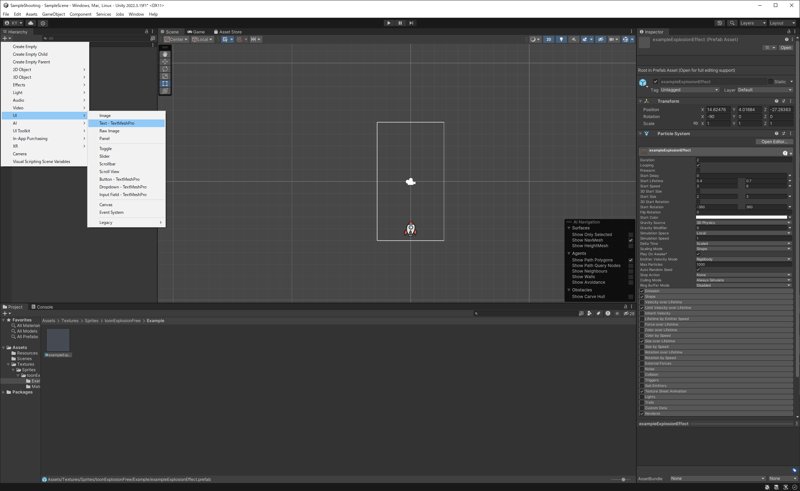

# Sample Shooting

## Procedure

### ロケットを動かそう
1. プロジェクトを作成しよう
   画面の設定を行いましょう。今回は縦長の画面レイアウトにするのでGameタブをクリックし、アスペクト比を選択します。
   Unityには縦長のアスペクト比が用意されていないため、一番下の「＋ボタン」をクリックしてTypeに「Aspect Ratio」、Width&Heightに「9:16」と入力して下さい。
   

2. ロケットを配置しよう
   準備が出来たところで、まずはUnityでのゲーム作りの第一歩として画像を画面に出しましょう。
   Unity2Dでは画面上に表示する画像のことを「スプライト」と呼びます。
   今後はスプライトという呼び名を使うので覚えておいて下さいね！

   では先ほどプロジェクトビューに登録したロケットのスプライト（rocket）をシーンビューにドラッグ＆ドロップして下さい。
   
   シーンビューに配置されたスプライトがヒエラルキービューにも一覧として表示されています。このようにシーンビュー上のスプライトとヒエラルキービューのリストは対応していることを覚えておいて下さい。

   ロケットのスプライトを表示する場所はインスペクタから変更できます。
   ヒエラルキービューで「rocket」を選択すると、Unityエディタ右側のインスペクタにロケットの詳細情報が表示されます。

   ここでは、「Transform」項目のPositionを「0,-4,0」に設定します。
   

1. ロケットを動かそう
   左右キーの入力に応じてロケットを動かすために、C#スクリプトを作成します。
   　
   プロジェクトビューで右クリックし、「Create」→「C# Script」を選択して下さい。
   作成したファイル名をRocketControllerに変更しておきましょう。
   

   RocketControllerをダブルクリックしてエディタを開き、次のスクリプトを入力して下さい。
   ```cs
   using UnityEngine;
   using System.Collections;

   public class RocketController : MonoBehaviour {
      void Update () {
         if (Input.GetKey (KeyCode.LeftArrow)) {
            transform.Translate (-0.1f, 0, 0);
         }
         if (Input.GetKey (KeyCode.RightArrow)) {
            transform.Translate ( 0.1f, 0, 0);
         }
      }
   }
   ```
   Input.GetKey関数を使って引数に指定したキーが押されているかを調べています。
   キーが押されていた場合にはTranslate関数を使ってロケットの位置を移動させています。
   Translate関数は現在の位置から引数に与えたぶんだけ移動させる関数です。引数に与えた座標に動かすのではないことに注意して下さい。

   スクリプトが完成したら、作成したスクリプトをロケットにアタッチしましょう。
   Unityでは、スクリプトをオブジェクトにアタッチすることでオブジェクトがスクリプトどおりに動くようになります。
   　
   プロジェクトビューから「RocketController」を選択し、ヒエラルキービューの「rocket」にドラッグ＆ドロップして下さい。
   

### 弾を発射しよう

1. 弾のスプライトを配置しよう
   ロケットから弾を発射する流れは次のようになります。

   1. 弾を１つだけ表示して画面上方向に移動するようにします。
   1. 作成した弾をもとにして弾のPrefab（設計図）を作ります。
   1. スペースキーを押すたびにPrefabから弾のインスタンスを作ります。

   ロケットを配置した時と同じように、弾のスプライトを画面上に配置しましょう。
   プロジェクトビューから「bullet」を選択し、シーンビューにドラッグ＆ドロップして下さい。
   弾を配置する座標は後ほどスクリプトで指定するので、ここでは適当でかまいません。

   

   弾が配置できたら、次は弾を上方向に移動させるスクリプトを作成します。
   プロジェクトビューで右クリックし「Create」→「C# Script」でスクリプトを作成し、ファイル名を「BulletController」に変更します。

   

   作成した「BulletController.cs」を開き、次のスクリプトを入力して下さい。

   ```cs
   using UnityEngine;
   using System.Collections;

   public class BulletController : MonoBehaviour {
      void Update () {
         transform.Translate (0, 0.2f, 0);

         if (transform.position.y > 5) {
            Destroy (gameObject);
         }
      }
   }
   ```
   ここでもロケットを動かしたときと同じようにTranslate関数を使って弾を毎フレーム0.2fづつ上方向（y軸方向）に移動しています。

   ただし、このままだと弾が画面の外にでてからも動き続けることになります。
   見えない場所で動かし続けるのはCPUの無駄使いなので、画面の上端（y=5）をこえた場合にはDestroyメソッドを使って弾を破棄します。

   ファイルを保存できたら、ロケットの時と同様にスクリプトをアタッチしましょう。
   プロジェクトビューの「BulletController」を「bullet」にドラッグ＆ドロップして下さい。

   

   スクリプトがアタッチできたら、ゲームを実行してみてください。弾が上方向に移動しましたね。

   

   Prefabが作れたら、画面上に配置した弾は不要です（設計図があればいつでも作れるため）ヒエラルキービューから「bulletPrefab」を選択し、右クリック→「Delete」を選択します。

   

1. Prefabからインスタンスを作ろう

   次はスペースキーが押されるたび、弾のPrefabをから弾のインスタンス（複製）を作るスクリプトを作成しましょう。

   前回作成した「RocketController.cs」を開いて次のようにスクリプトを修正します。

   ```cs
   using UnityEngine;
   using System.Collections;

   public class RocketController : MonoBehaviour {

      public GameObject bulletPrefab;

      void Update () {
         if (Input.GetKey (KeyCode.LeftArrow)) {
            transform.Translate (-0.1f, 0, 0);
         }
         if (Input.GetKey (KeyCode.RightArrow)) {
            transform.Translate ( 0.1f, 0, 0);
         }
         if (Input.GetKeyDown (KeyCode.Space)) {
            Instantiate (bulletPrefab, transform.position, Quaternion.identity);
         }
      }
   }
   ```

   このスクリプトではGetKeyDown関数を使ってスペースキーが押されたことを検知し、弾のPrefabから弾のインスタンスを作っています。
   GetKeyDown関数はGetKey関数と違って、キーが押下された時に一度だけtrueになる関数です。
   　
   弾のPrefabからインスタンスを作るために、Instantiate関数を使っています。
   Instantiate関数は、第一引数にPrefab、第二引数にインスタンスを生成する位置、第三引数にはインスタンスの回転角を指定します。
   ここではRocketControllerの中でtransform.positionと書いているので、ロケットの位置に弾を生成しています。

   最後に、作成したbulletPrefabとスクリプト内で宣言した変数とを関連付けます。
   ヒエラルキービューからrocketを選択し、インスペクタから「RocketControllerスクリプト」の項目を探し、「bullet Prefab」の欄に、プロジェクトビューから「bulletPrefab」をドラッグ＆ドロップして下さい。

   

   ここまで出来たら、実行してみましょう。スペースキーを押すたびに弾が発射されるようになりました。

### 隕石を落下させよう
1. テクスチャからスプライトをスライスする
   ここまでに出てきたロケットや弾のテクスチャは、１枚のテクスチャに１つの画像が描かれていました。
   一方、隕石の画像は１枚のテクスチャに８つのスプライトが描かれています。このようなテクスチャをテクスチャアトラスとよび、テクスチャアトラスを使うことで実行時の計算効率が良くなります。

   テクスチャアトラスからスプライトを切り出す方法は次のとおりです。
   まずプロジェクトビューで「Rock」を選択し、インスペクタの「Sprite Mode」を「Multiple」に設定し、「Sprite Editor」ボタンを押して下さい。

   

   「Sprite Editor」が起動するので、画面左上の「Slice」ボタンをクリックし、「Type」が「Automatic」になっていることを確認してから、「Slice」ボタンを押して下さい。

   

   スプライトの周辺にうっすらとスライスのための枠線が表示されています。問題なければ画面中央の「Apply」ボタンを押して下さい。

   スライスの範囲を修正したい場合には、修正したいスプライトを選択し、スライス領域を指定します。

   

1. 隕石を表示しよう
   スプライトを個別に切り出すことが出来たので、正しくスライス出来たか確認しましょう。
   プロジェクトビューで「Rock」の「▶」ボタンをクリックすると、スライスされたスプライトが表示されます。
   　
   スライスされた隕石から１つを選択してシーンビューに配置します。
   配置する座標はのちほどスクリプトから決めるのでここでは適当で大丈夫です。

   

1. 隕石を落下させよう
   隕石が落下してくるようにスクリプトを作成しましょう。
   プロジェクトビューで右クリックから「Create」→「C# Script」を選択し、出来たファイルの名前を「RockController」に変更します。ファイルを開いて次のスクリプトを入力して下さい。

   ```cs
   using UnityEngine;
   using System.Collections;

   public class RockController : MonoBehaviour {

      float fallSpeed;
      float rotSpeed;

      void Start () {
         this.fallSpeed = 0.01f + 0.1f * Random.value;
         this.rotSpeed = 5f + 3f * Random.value;
      }

      void Update () {
         transform.Translate( 0, -fallSpeed, 0, Space.World);
         transform.Rotate(0, 0, rotSpeed );

         if (transform.position.y < -5.5f) {
            Destroy (gameObject);
         }
      }
   }
   ```

   隕石が回転しながら落下するようにTranslate関数とRotate関数を使っています。
   また、Randomメソッドを使って落下速度が隕石ごとに変わるようにしています。
   隕石が画面下端を超えた場合は、Destroyメソッドで自分自身のオブジェクトを破棄しています。

   スクリプトが作成できたら、隕石オブジェクトにアタッチしましょう。
   プロジェクトビューから「RockController.cs」を選択し、ヒエラルキービューの「rock_0」にドラッグ＆ドロップして下さい。

   

   実行してみて、隕石が回転しながら落下してくるのを確認しましょう。

1. 隕石を時間とともに生成する

   ゲーム中で生成されるオブジェクトは、Prefab化してスクリプトで生成するのが定石です。
   流れとしては弾を作ったときと同様、次のようなステップです。

   1. 生成したいオブジェクトをPrefab化する
   1. スクリプトでPrefabからインスタンスを作る
   1. Prefabの実体とスクリプト内の変数を関連付ける

   まずは隕石のPrefabを作成しましょう。ヒエラルキービューから「rock_0」を選択し、プロジェクトビューにドラッグ＆ドロップします。
   作成したPrefabの名前を「RockPrefab」に変更します。

   

   Prefabができたら画面上の隕石は不要なので消しておきます。
   ヒエラルキービューの「RockPrefab」を右クリックし「Delete」を選択して下さい。

   

   弾はスペースキーが押されたタイミングでインスタンスを生成していました。
   今回は、一定時間たつと自動的に隕石のインスタンスを生成するようにしましょう。

   プロジェクトビューで右クリックして「Create」→「C# Script」を選択し、出来たファイルの名前を「RockGenerator」に変更します。
   ファイルを開いて次のスクリプトを入力して下さい。

   ```cs
   using UnityEngine;
   using System.Collections;

   public class RockGenerator : MonoBehaviour {

      public GameObject rockPrefab;

      void Start () {
         InvokeRepeating ("GenRock", 1, 1);
      }

      void GenRock () {
         Instantiate (rockPrefab, new Vector3 (-2.5f + 5 * Random.value, 6, 0), Quaternion.identity);
      }
   }
   ```

   隕石を１秒に１回生成するために、InvokeRepeating関数を使っています。InvokeRepeating関数は第一引数の関数を第二引数の秒数ごとに実行してくれる結構便利な関数です。
   ここではGenRock関数を呼び出し、その中でランダムな位置に隕石を生成しています。

   ファイルが生成できたところでゲームオブジェクトにRockGeneratorスクリプトをアタッチします。
   アタッチする適切なオブジェクトが無いので、ヒエラルキービューの「Create」→「Create Empty」で空のオブジェクトを生成します。

   

   作成したオブジェクトにスクリプトをアタッチします。ヒエラルキービューの「GameObject」にプロジェクトビューの「RockGenerator」をドラッグ＆ドロップして下さい。

   

   最後にスクリプト内で宣言したRockPrefab変数に、Prefabの実体を代入します。ヒエラルキービューで「GameObject」を選択して、インスペクタに表示される「Rock Prefab」の欄にプロジェクトビューの「RockPrefab」をドラッグ＆ドロップします。

   

   ゲームを実行してみて隕石が次々と落ちてくることを確認しましょう。

### 当たり判定をしよう

1. Unityで当たり判定をするには

   Unityで当たり判定をする場合には次の２通りがあります。

   1. 自前でオブジェクトの距離を計算する方法
   1. UnityのPhysicsを使う方法

   今回の記事では②のPhysicsを使った当たり判定の方法を紹介します。

   Physicsで当たり判定をする場合、自前で何かを計算する必要はありません。
   オブジェクト同士が衝突した場合にはUnityが特定の関数を呼び出してくれます。
   具体的には、衝突したオブジェクトにアタッチされているスクリプトのOnCollisionEnter関数が呼びだされます。

   Phsyicsを使って衝突検知をする場合、

   - 両方のオブジェクトにColliderコンポーネントをアタッチ
   - 少なくとも一方にはRigidbodyコンポーネントをアタッチ

   する必要があります。

   今回は隕石と弾の当たり判定をしたいので、両方のオブジェクトにColliderコンポーネントをアタッチし、弾にはRigidbodyコンポーネントをアタッチしましょう。

1. コンポーネントをアタッチしよう

   まずは隕石にColliderコンポーネントをアタッチします。プロジェクトビューから「RockPrefab」を選択し、インスペクタのAddComponentをクリックします。
   メニューから「Pysics2D」→「Circle Collider2D」を選択します。

   

   シーンビューのRockPrefabを選択すると、隕石の周りに緑色の円が表示されています。
   これが当たり判定のためのCircle Colliderになります。

   弾にはColliderコンポーネントとRigidbodyコンポーネントをアタッチします。
   プロジェクトビューから「BulletPrefab」を選択し、インスペクタのAddComponentをクリック、「Pysics2D」→「Circle Collider2D」を選択します。

   

   続いてRigidbodyコンポーネントをアタッチしましょう。
   先ほどと同じように、プロジェクトビューから「BulletPrefab」を選択したうえで、インスペクタのAddComponentから「Pysics2D」→「Rigidbody2D」を選択します。

   いまアタッチしたCircle Collider 2Dコンポーネントの「Is Trigger」にチェックを入れます。
   「Is Trigger」をチェックすると、オブジェクト衝突時に、衝突検知だけをして、衝突オブジェクトはすり抜けるようになります（跳ね返らなくなります）

   

   また、Rigidbodyコンポーネントの「Body Type」を「Kinematic」にします。
   「Kinematic」にすることで、弾は重力などの物理的な力を受けなくなります（この設定を入れないと、重力で弾は下に落ちていこうとします）

   

1. スクリプトから衝突を検知しよう

   スクリプトから、弾と隕石が衝突したことを検知します。
   衝突時にはRockControllerかBulletControllerに「OnCollisionEnter2D関数」が実装されていれば、その関数が呼び出されます。

   ここではBulletControllerにOnCollisionEnter2Dを付け加えてましょう。
   プロジェクトビューからBulletControllerを開いて、次のスクリプトを入力して下さい。

   ```cs
   using UnityEngine;
   using System.Collections;

   public class BulletController : MonoBehaviour {
      void Update () {
         transform.Translate (0, 0.2f, 0);

         if (transform.position.y > 5) {
            Destroy (gameObject);
         }
      }

      void OnTriggerEnter2D(Collider2D coll) {
         Destroy (coll.gameObject);
         Destroy (gameObject);
      }
   }
   ```

   OnTriggerEnter2D関数の中でDestroy関数を使って隕石と弾のオブジェクトを破棄しています。
   ゲームを実行して、当たり判定ができているかを確かめてみましょう。

1. 爆発のエフェクトを追加しよう

   隕石を破壊した時に、ただ消えるだけでは寂しいので、爆発のエフェクトを追加します。
   Asset Storeに「Toon Explosion VFX Texture Free」という素材があるので、今回はそれを利用します。

   
   
   

   このアセットは爆発エフェクトが繰り返し表示される設定になっています。
   今回は隕石と弾が衝突した時に一度だけ爆発エフェクトを表示したいので設定を変更します。

   プロジェクトビューから「Assets→Textures→Sprites→toonExplotionFree→Example」の中にある「exampleExplosionEffect」を選択し、インスペクタの「Particle System」→「Looping」のチェックを外します。

   

   隕石と弾が衝突した時にエフェクトを表示したいので、先ほどのOnTriggerEnter2D関数の中に、爆発エフェクトを生成する処理を追加します。

   ```cs
   using UnityEngine;
   using System.Collections;

   public class BulletController : MonoBehaviour {

   //爆発エフェクトのPrefab
      public GameObject explosionPrefab;

      void Update () {
         transform.Translate (0, 0.2f, 0);

         if (transform.position.y > 5) {
            Destroy (gameObject);
         }
      }

      void OnTriggerEnter2D(Collider2D coll) {
         // 爆発エフェクトを生成する
         GameObject explosion = Instantiate (explosionPrefab, transform.position, Quaternion.identity);
         Destroy (coll.gameObject);
         Destroy (gameObject);
         Destroy (explosion, 2.0f);
      }
   }
   ```

   スクリプト中で宣言したexplosionPrefab変数にPrefabの実体を代入します。
   プロジェクトビューから「bulletPrefab」を選択し、インスペクタから「Bullet Controller (Script)」の中にある「Explosion Prefab」の欄を探して下さい。
   そこにインポートした爆発エフェクトのPrefabをドラッグ＆ドロップします。

   

   実行して正しく爆発エフェクトをが表示されるかみてみましょう。

### ゲームオーバを判定しよう

1. uGUIを使ってテキストを表示しよう
   UnityにはUIを簡単に作れるuGUIというシステムがあります。
   このuGUIを使ってゲームオーバとスコアのテキストをシーンビューに追加しましょう。

   ヒエラルキービューから「Create」→「UI」→「Text」を選択して下さい。ヒエラルキービューに「Canvas」が作られ、その下にTextが生成されます。

   

   Textの名前を「Score」に変更し、インスペクタの設定を下記のように行います。

   

   ゲームオーバのテキストも、同様の手順で配置しましょう。ヒエラルキービューから「Create」→「UI」→「Text」を選択して、作成したTextの名前を「GameOver」に変更し、インスペクタの設定を下記のように行います。

   

1. スクリプトからスコアを更新しよう

   次に、スコアを更新するためのスクリプトを作成します。
   プロジェクトビューで「右クリック」→「Create」→「C# Script」を選択し、ファイル名を「UIController」に変更して下さい。

   UIControllerに次のスクリプトを入力します。

   ```cs
   using UnityEngine;
   using UnityEngine.UI;
   using System.Collections;
   using TMPro;

   public class UIController : MonoBehaviour {

      int score = 0;
      GameObject scoreText;

      public void AddScore(){
         this.score += 10;
      }

      void Start () {
         this.scoreText = GameObject.Find ("Score");
      }

      void Update () {
         scoreText.GetComponent<TMP_Text> ().text = "Score:" + score.ToString("D4");
      }
   }
   ```

   このスクリプトでは、Start関数の中でシーンビューに配置したUIのText（Scoreテキスト）を検索し、メンバ変数に保存しています。
   Update関数内でTextにスコアを代入しています。
   Add関数は弾と隕石が衝突したときに呼び出される関数で、この中でスコアの更新を行っています。

   ここで一度、動作を確認してみましょう。
   プロジェクトビューの「UIController」をヒエラルキービューの「Canvas」にドラッグ＆ドロップして下さい。

   

   実行すると、右上にスコアが表示されます。
   でも、隕石を破壊してもスコアが増えずに「0000」のままですね...
   これはUIControllerに実装したAddScore関数を呼び出していないのが原因です。

   スコアが更新されるようにAddScore関数を呼び出す部分を作成します。
   弾と隕石が衝突したときにスコアを増やしたいので、BulletControllerのOnTriggerEnter2Dの中でAddScore関数を呼び出します。
   BulletControllerを開いて次のスクリプトを追記して下さい。

   ```cs
   using UnityEngine;
   using System.Collections;

   public class BulletController : MonoBehaviour {

      public GameObject explosionPrefab;

      void Update () {
         transform.Translate (0, 0.2f, 0);

         if (transform.position.y > 5) {
            Destroy (gameObject);
         }
      }

      void OnTriggerEnter2D(Collider2D coll) {
         // 衝突したときにスコアを更新する
         GameObject.Find ("Canvas").GetComponent<UIController> ().AddScore ();

                  // 爆発エフェクトを生成する
         GameObject effect = Instantiate (explosionPrefab, transform.position, Quaternion.identity) as GameObject;
         Destroy (effect, 1.0f);

         Destroy (coll.gameObject);
         Destroy (gameObject);
      }
   }
   ```

   もう一度実行して、スコアが増えることを確認しましょう。

1. ゲームオーバを表示しよう

   隕石が画面下のラインを超えたときに、画面上にGameOverを表示するため、UIControllerにGameOver関数を追加しましょう。
   GameOver関数ではシーンビューのTextに"GameOver"の文字列を代入しています。

   ```cs
   using UnityEngine;
   using UnityEngine.UI;
   using System.Collections;
   using TMPro;

   public class UIController : MonoBehaviour {

      int score = 0;
      GameObject scoreText;
      GameObject gameOverText;

      public void GameOver() {
         this.gameOverText.GetComponent<TMP_Text>().text = "GameOver";
      }

      public void AddScore(){
         this.score += 10;
      }

      void Start () {
         this.scoreText = GameObject.Find ("Score");
      this.gameOverText = GameObject.Find ("GameOver");
      }

      void Update () {
         scoreText.GetComponent<TMP_Text> ().text = "Score:" + score.ToString("D4");
      }
   }
   ```

   隕石が画面下のラインを超えたときにゲームオーバと判定します。
   画面下端を超えたかどうかはRockControllerで判定していたので、そこでUIControllerのGameOver関数を呼び出します。

   ```cs
   using UnityEngine;
   using System.Collections;

   public class RockController : MonoBehaviour {

      float fallSpeed;
      float rotSpeed;

      void Start () {
         this.fallSpeed = 0.01f + 0.1f * Random.value;
         this.rotSpeed = 5f + 3f * Random.value;
      }

      void Update () {
         transform.Translate( 0, -fallSpeed, 0, Space.World);
         transform.Rotate(0, 0, rotSpeed );

         if (transform.position.y < -5.5f) {
            GameObject.Find ("Canvas").GetComponent<UIController> ().GameOver ();
            Destroy (gameObject);
         }
      }
   }
   ```

   ゲームを実行すると次のようになります。かなりゲームっぽくなってきましたね！

### お化粧をしよう

1. 背景をスクロールしよう

   背景が青色１色なのは地味で寂しいです。
   背景をスクロールを使って星が流れるようにしましょう。背景をスクロールするには次の2つを繰り返します。

   1. 少しずつ背景を移動
   1. 一定量スクロールしたら元の場所に戻す

   まずは、背景のスプライトを配置します。
   プロジェクトビューから「background」をシーンビューに配置して、インスペクタからPositionを(0, 4.8, 0) に設定して下さい。

   また、ロケットや隕石、爆発エフェクトが背景よりも手前に表示されるように、背景のスプライトの「Order in Layer」を「-1」に設定します。

   

   次に、プロジェクトビューで右クリックし「Create」→「C# Script」を選択します。
   作成したファイル名を「BackgroundController」に変更して次のプログラムを入力してください。

   ```cs
   using UnityEngine;
   using System.Collections;

   public class BackgroundController : MonoBehaviour {

      void Update () {
         transform.Translate (0, -0.03f, 0);
         if (transform.position.y < -4.9f) {
            transform.position = new Vector3 (0, 4.9f, 0);
         }
      }
   }
   ```

   このプログラムでは、毎フレーム背景を下方向に0.02ずつ移動しています。
   スクロールしていき、背景画像の座標が一定値以上小さくなったときに、元の位置に戻しています。

   作成したスクロールするスクリプトを背景画像にアタッチします。
   プロジェクトビューの「BackgroundController」をヒエラルキービューの「background」にドラッグ＆ドロップしてください。

   

   実行して背景がスクロールすることを確かめておきましょう。

1. UIの設定を見直そう

   ゲームを実行した状態でUnityエディタを拡大縮小してみてください。
   右上に表示しているスコアの文字サイズは変化していません。

   このように、UIに関しては画面サイズによらずに決まったピクセル数で描画されてしまいます。
   様々な解像度のデバイスで同じような見た目にするためには、CanvasにアタッチされているCanvas Scalerコンポーネントを修正します。

   ヒエラルキービューから「Canvas」を選択した状態で、インスペクタの「Canvas Scalerコンポーネント→UI Scale Mode」を「Scale With Screen Size」に設定し、「Screen Match Mode」を「Expand」に設定します。

   

   上記の設定をしたことで、フォントがものすごく小さく表示されていると思います。
   ヒエラルキービューから「Canvas/Score」を選択し、Rect TransformのPositionを（-200, -60, 0） に、WidthとHeightを(400, 120) に修正し、フォントサイズを「60」に設定します。

   

   同様にGameOverのラベルもサイズを再調整しておきましょう。
   ヒエラルキービューから「Canvas/GameOver」を選択し、Rect TransformのWidthとHeightを(450, 120) に、フォントサイズを「80」に設定します。

   
